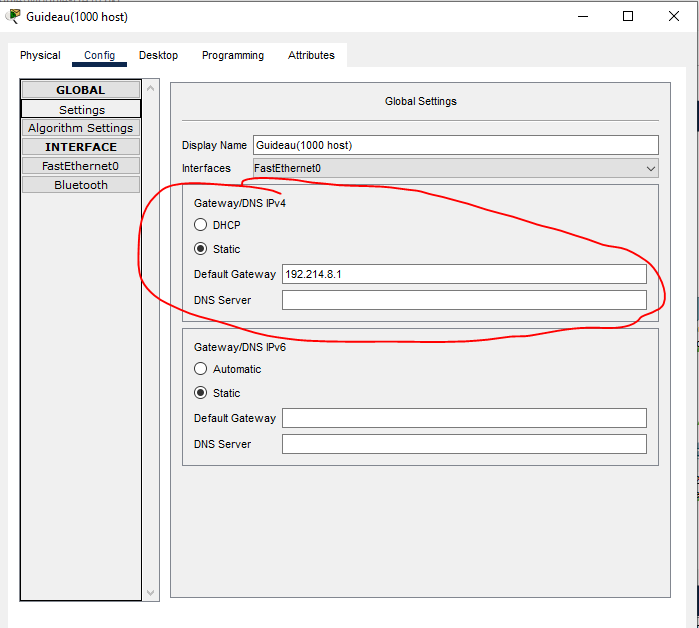
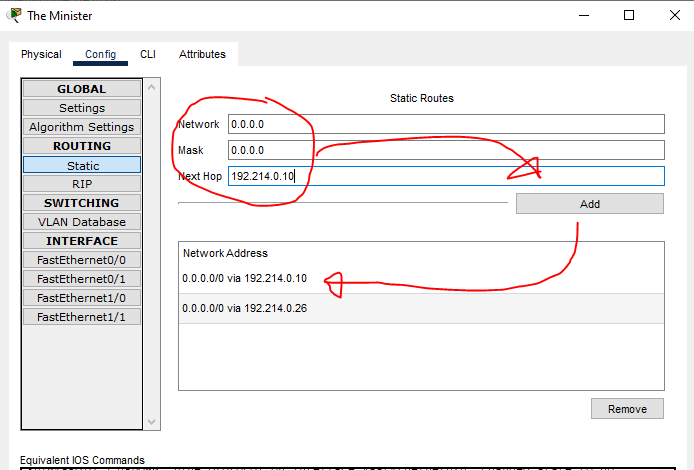

# Jarkom-Modul-4-ITA10-2022
**Laporan Resmi praktikum Jarkom kelompok ITA10**
 
Kelompok:
- Hafizh Abid Wibowo (5027201011)
- Muhammad Farrel Abdillah (50272010570)
 
Berikut adalah Dokumentasi dan langkah pengerjaan untuk laporan resmi praktikum jarkom modul 4 oleh kelompok ITA10
 

# **Konfigurasi: Topologi**
Berikut ini merupakan screenshot dari topologi yang akan digunakan untuk mengerjakan soal shift praktikum.
 
Pengerjaan dilakukan dengan metode VLSM dengan prefix IP untuk kelompok kami yaitu 192.214 dan menggunakan Cisco Packet Tracer. 
 

# **Subnetting**
Sebelum memulai pengerjaan, dilakukan pembagian subnet terhadap topologi dalam soal. Hasil pembagian tersebut adalah:
 

  
Dari hasil pembagian, terdapat 18 total subnet dari A1 hingga A18. 

# **Perhitungan dengan metode VLSM**
1. Menentukan jumlah alamat IP yang dibutuhkan oleh tiap subnet dari 18 subnet yang ada
    
   
2. Subnet yang dibentuk memiliki NID 192.214.0.0 dengan netmask /20. Setelah itu akan dilakukan perhitungan IP yang dibuat dalam bentuk tree 
    
   
3. Setelah berhasil membuat tree dalam perhitungan pembagian IP, akan dibuat tabel untuk setiap subnet untuk memudahkan keperluan dalam konfigurasi subnetnya nanti.
    
   
  
# **Konfigurasi Subnet**
Dalam topologi yang telah dibuat di Cisco Packet Tracer, beberapa node yang perlu dikonfigurasikan terbagi menjadi 3 bagian:
1. PC
    
   
    
   Untuk melakukan konfigurasi pada PC, pertama-tama melihat dan mengidentifikasi di bagian subnet mana pc tersebut terletak. 
   Kemudian, double click node yang ingin dikonfigurasikan dan click tab "Config".
   Setelah itu, digunakan tabel subnet yang telah dibuat untuk mengisi ip pada gateway dan ethernet serta subnet mask nya.
    
    
   IP yang digunakan adalah bagian "Assignable IP Range" pada tabel. Untuk gateway, digunakan Assignable IP pada minimum range.
    
   
    
   Sedangkan pada ethernet, digunakan Assignable IP pada maximum range serta masukkan subnet mask sesuai dengan bagiannya pada tabel subnet. 
   Tidak lupa juga untuk mencentang port status supaya bisa terhubung.
    
   
    
   
2. Router
    
   
    
   Untuk melakukan konfigurasi pada Router, pertama-tama melihat dan mengidentifikasi di bagian subnet mana router tersebut terletak. 
   Kemudian, double click node yang ingin dikonfigurasikan dan click tab "Config".
   Setelah itu, digunakan tabel subnet yang telah dibuat untuk mengisi ip pada routing-static dan ethernet serta subnet mask nya.
    
    
   Sama seperti PC, untuk menentukan IP yang akan digunakan akan dilihat tabel pada bagian "Assignable IP Range" sesuai dengan kelompok subnetnya.
   pada bagian ethernet yang sesuai (tersambung dengan pc/server/router sesuai dengan subnetnya), akan digunakan assignable IP pada minimum range kemudian centang port    status supaya bisa terhubung.
    
   
    
   kemudian, untuk menyambungkan router ke router, tekan menu routing -> static pada tab "Config" untuk menambahkan IP router lain yang ingin dituju lalu tekan add.
    
   
   
3. Server
    
   
    
   Konfigurasi pada server memiliki langkah yang sama dengan PC yaitu:
    
   cek assignable IP sesuai dengan subnet, lalu dilanjut dengan memasukkan assignable IP minimum range tersebut kedalam gateway.
    
   
    
   dan memasukkan assignable IP maximum range kedalam ethernet lalu mecentang port status.
    
   
    
 
# **Test Ping**
Untuk melihat apakah IP yang dimasukkan terpasang dan terhubung secara efisien, dapat dilakukan ping test untuk setiap node. Contohnya adalah
PC ke PC, PC ke Router, PC ke Server, dan sebagainya.
 
 
Pertama, tekan tombol surat yang terdapat pada menu cisco packet tracer (atau dengan shortcut tombol "P" pada keyboard)
 

 
Setelah itu, click 2 node yang ingin dihubungkan.
 

 
 
Untuk konfirmasi apakah ping berhasil, dapat di cek pada bagian pojok kanan bawah Cisco Packet Tracer.
 
Apabila koneksi berhasil, akan tampil status "Successful" seperti:
 

 
dan apabila gagal, akan tampil status "Failed" seperti:
 

 
terkadang, koneksi yang dilakukan sebenarnya berhasil, namun hanya membutuhkan waktu untuk stabil sehingga tetap muncul status "Failed".
Hal ini dapat dihindari dengan melakukan fast forward time dengan aplikasi Cisco Packet Tracer atau melakukan ping secara bolak balik berulang kali, supaya dapat melakukan simulasi untuk lebih cepat menstabilkan koneksi.
 

# **Kesulitan yang dialami**
- Kesulitan dalam menghitung IP karena agak rumit
- Koneksi yang didapatkan kemungkinan besar tidak efisien karena butuh percobaan berkali kali untuk mendapatkan hasil "Successful" pada ping test
